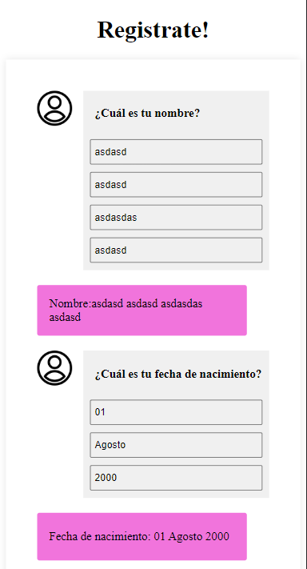
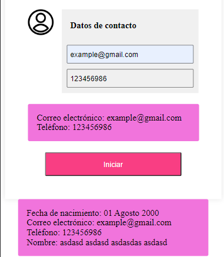
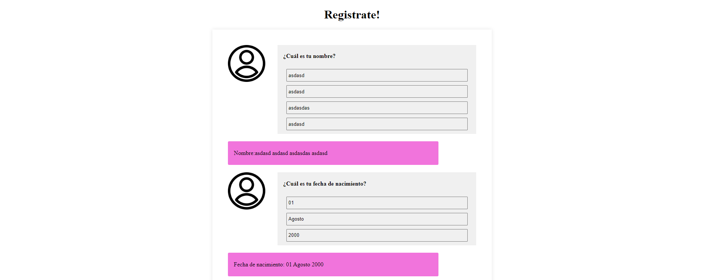

# Postulacion-TheRocketCode

Como inicializar la aplicación?

Agregar un .env en la carpeta api con los siguientes datos

DB_HOST =

DB_PASSWORD =

DB_USERNAME =

DB_NAME =

luego npm install y npm start.

Documentación de api: https://documenter.getpostman.com/view/21092024/2s9XxyRt9P

Vistas de la aplicación:

Movil:

Escritorio:

